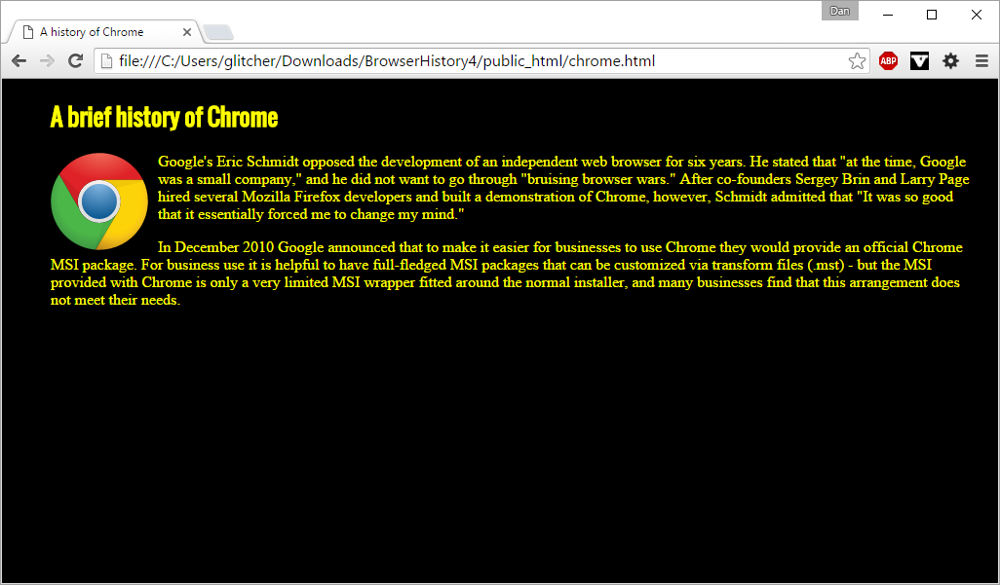

For this WOD, you will split the one page, three column "History of Browsers" web page from BrowserHistory3 into four separate web pages: a front page with three browser icons which link to three other pages containing the history of those three browsers.

So, the index.html page will look like this:

And one of the interior pages (chrome.html) will look like this:

Here are the specifications:

- Create a VS Code project called "BrowserHistory4"
- Copy index.html and style.css from BrowserHistory3 into this project OR just duplicate the BrowswerHistory3 project and rename BrowswerHistory4 (this is probably faster).
- Change index.html so that it contains only three icons, each 200x200 px wide. You can just replace the text in the anchors in the navbar list with the image tags you already have. __DON'T MAKE THIS HARDER THAN IT IS!__ All you need to do is put the img tags for the browser icons inside the link anchor tags. That is ``
- Each icon links to a separate page with the history of that browser.  These pages are named firefox.html, ie.html, and chrome.html (change the href in the anchor)
- The Introduction text will need to be put into a div with left margin 0px and right margin 300px.
- Each history page is titled "A history of <X>", where X is that browser, and has a top-level section with the same name as the title.
- Each history page has its corresponding icon inset into the text similarly to BrowserHistory3.
- All history text is copied from BrowserHistory3.
- All pages have a black background and yellow text

