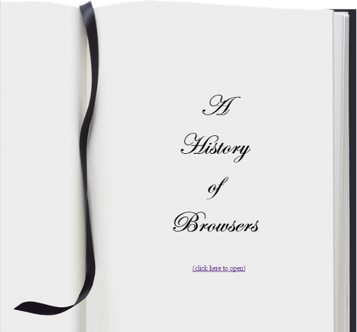
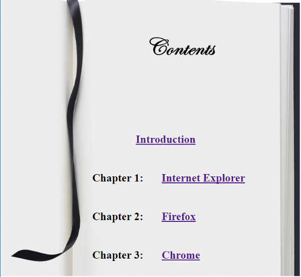
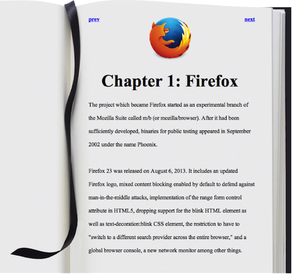

For this WOD, you will split the one page, three column "History of Browsers" web page into 
five separate web pages: 

1. An index.html front page with an introduction title using Edwardian Script ITC font (this is NOT a Google font). This page 
should allow the user to click on the page to move to the table of contents page (page 2)
<br> 
<br>
2. A table of contents page with links to three chapter pages containing the history of the three browsers.
<br> 
<br>
3. Three pages containing the history of the three browsers. An example page (firefox.html) will look like this:
<br>


Here are the specifications:

- Create a VS Code project called "BrowserHistory5"
- Copy index.html and style.css from BrowserHistory3 into this project.
- Create new files contents.html, intro.html, ie.html, firefox.html, chrome.html and copy index.html into it. A good way to do this is by selecting index.html and copy to pasteboard (Ctrl+C or Cmd+C or use the menu) then select the site root and paste (Ctrl+V or Ctrl+V) and repeat this 5 times. Then select and rename these files.  
- In index.html delete everything in the <body> except the <h1> tag. Give this tag the class "fancy" and place <br>'s in between the words. Add a link to contents.html with the text "(click here to open)". In the <body> tag set the attribute style="margin-top: 200px" 
- In contents.html remove everything but the navbar <div> and <h1>. Change the <h1> to say "Contents" and add the attributes style="margin-top: 100px";" class="fancy" to this <h1>. Now modify the <li>'s to href the browser history files (e.g. ie.html) and add the Charper labels. Add the attribute style="margin-left: 25%; margin-right: 25%;" to the intro <li>
- Start with ie.html and delete everything but the <div> for the ie history. Add the following at the top of the <div>
```            
			<a class="left" href="contents.html">prev</a>
            <a class="right" href="firefox.html">next</a>
            <p>
            
            </p>
```		
- Change the <h2> to `<h2 class="chapter">Chapter 1: Internet Explorer</h2>`	
- Title the page "A history of internet explorer"
- Repeat the above for the other history pages. Take care to set the prev and next links to the appropriate pages.
  
- In style.css add 
```  
background-image: url('https://dport96.github.io/ITM352/morea/030.ui-basics/page.gif');
background-repeat: no-repeat;
``` 
to the body style. Change the color to black and set the margin to `40px 320px 200px 250px;`. The width should be 475px; add `line-height: 175%;`
- Change the img style to `float: center; margin: 0px 0px 10px 150px;`
- Change the li style from inline to block
- Change the ul style to
```
    list-style-type: none;
    padding: 0;
    line-height: 350%;
    font-size: 30px;
    font-weight: bold;
```
- Add the following class styles

```
h1.fancy {
    font-family: Edwardian Script ITC; 
    font-size: 50pt; 
    text-align: center;
    line-height: 135%;
}

h2.chapter {
    font-size: 30pt;
    text-align: center;
}

a.left {
    float: left;
    font-weight: bold;
}

a.right {
    float: right;
    font-weight: bold;
}
```

