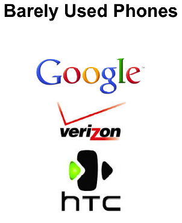
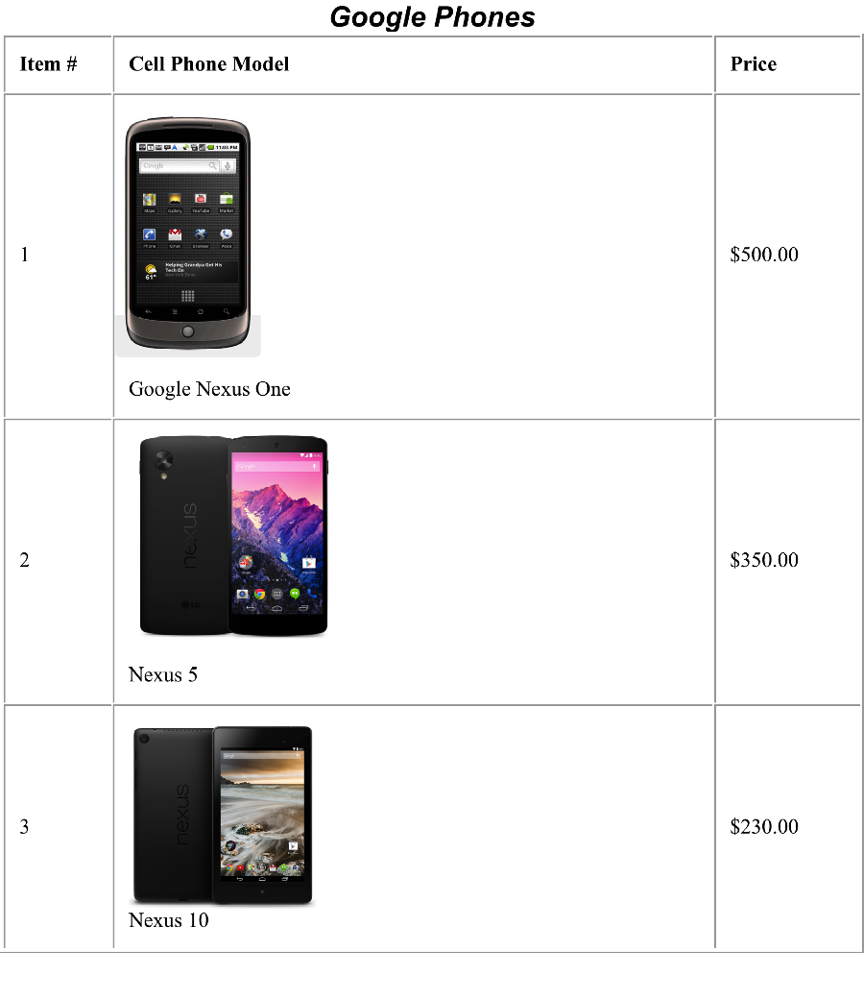

# WOD Instructions 

The marketing director of a company selling used smart phones approaches you to 
help design an e-commerce website for his company. 
He asks you to design a website that will display at least **three** different products to the user.

1. You will be randomly put into small teams. Get in your team and choose a team name.
2. Create a new HTML5 project in VS Code and name it your team name (each team member or just one, you decide)
3. Develop a webpage with the following requirements: 
 - display available smart phones brands on a home page
 - display **three* pages of available used smart phones by maker (e.g. Nokia, Samsung). Each page contains phones from one make
 listing name/model number, description, price.
 
 The front page may look something like this:
 
 
 
A cell phone brand display may look something like this: 

The main requirements for this assignment are the following: 

 - Use HTML tables
 - CSS to make a flexible styled and pleasent display 
 
You are allowed to take **snippets** of code (i.e. from BrowserHistory, online), 
but must GIVE CREDIT to the original author in your comments. 
Give the author name and source location (if publicly accessible) in comments. 
Also give explanations of all your code and borrowed code in comments. 
You may not us an entire webpage from another source. You may not use a webpage development
tool such as DreamMaker or FrontPage. You can use images from the web. You can use whatever
five smart phones you wish.

# Submission instructions
Upload your files to the class website ITM-VM.shidler.edu/ITM352student into a folder 
with your team name. Be sure to include all code and images (if not liked to the web). 

This is a **competitive** WOD. When your team is done, contact the instructor to review your website
and give you scores based on (1) time, (2) quality, (3) design

Mark your WOD-velope card with "Group WOD: Smart Phone Offerings - <team name>" and the instructor will 
indicate your team ranking in the results. 

After completing this assignment, you will wrote a blog entry describing your experience working with others
to develop a webpage. What worked well? What was tough? How could it be better if done over?
