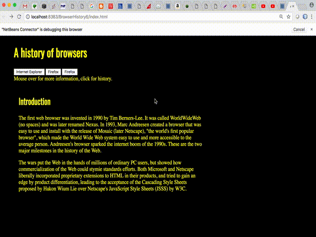

For this WOD, you will start with BrowserHistory3 and split the one page, three column "History of Browsers" web page into four separate web pages: a front page with the Introduction and three buttons which link to three other pages containing the history of those three browsers.
When the mouse moves over a button, it displays the corresponding browser icon in the area below the buttons.

Here is how the dynamic page should look and work:

Here are the specifications:

1. Make a copy of your BrowserHistory3 project and rename it "BrowserHistory6"
1. Change the all the anchor tags in the navbar to <input type="button> and set the first button value to FireFox, second to Chrome, and third to Internet Explorer.
1.  Add three new html files to the project named firefox.html, chrome.html, ie.html and cut and paste the respective history materials from their `
`'s in to each respective file. Remove the `
`'s. Copy the style sheet link into each of the these files. Leave the Introduction material in file index.html
1.  Change the body style in the CSS to have yellow text with black background
1.  In the file index.html, add a div with id="imgbox" under the navbar div. Put the text "Mouse over for more information, click for history." in content for this div
1.  Change the all the anchor tags in the navbar `<li>`s to `<input type="button">` and set the first button value to FireFox, second to Chrome, and third to Internet Explorer. Keep the href attributes for now. 
1.  In each button add the onclick event to set window.location.href to the appropriate history page file (you can use the existing href from the anchor tag). Example, `onclick="window.location.href = 'firefox.html'"`
1.  For each button, add an onmouseover event that will set the innerHTML for the imgbox div to a an img tag with the corresponding image for that button. For example on the Chrome button, `onmouseover ="imgbox.innerHTML=''"` (Note that the URL is just an example and not what you will use exactly.)

**Hint:** It is suggested that you change just one anchor tag first. Test it, and when it works, copy it twice then copy and paste the href and img tags from the old `<li>`'s. 

**Hint2:** The quotes for the javascript attribute values (e.g. onmouseclick) can be tricky here. The suggested approach is to use double-quotes `"` for attributes and single-quotes `'` for javascript strings used inside the double-quotes. In general you can remove all the quotes for HTML used in javascript. For example, you can set the html `` as javascript string for innerHTML as `onmouseover="someElement.innerHTML=''"`
 



If you get stuck you can see a few hints (well, pretty much the whole solution) at [here](https://youtu.be/73qaHpEAnYA). 