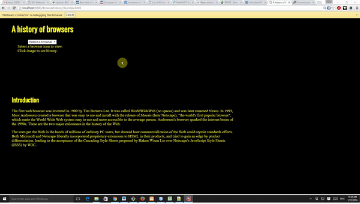

For this WOD, you will modify BrowserHistory6 to use a select box.
When the user selects an option, it displays the corresponding browser icon in the area below the select box. When the image is clicked it loads the corresponding history page. One of the options should be "Select a browser" (the default) and if the user selects this option the text "Select a browser icon to view. Click image to see history." will appear in the image box.

Here's what the page should look like and behave interacting with the user:

Here are the specifications:

- Create a VS Code project called "BrowserHistory7"
- Copy BrowserHistory6 files to the new project (in VS Code you can select the files and use "copy project" then rename the copy BrowserHistory7)
- Convert the `<input type=button>` tags to `<option>` tags and enclose them with `<select>  </select>`
- Each `<option>` should set it's value to the html needed for the browser selected to display the icon and link it to the corresponding history page. This should be an anchor tag with href set to the history file and an img tag with src set to the browser icon source (all this information will be in the original button html). Basicly you remove the input tags and javascript, add option tags which values that have anchor tags and the innerHTML (img tags) from the buttons.
- In the select tag use an onchange event to set the innerHTML attribute for the imgbox div element to `this.value`  ("this" is an id that always refers to the current element). The code looks like this: `<select onchange="imgbox.innerHTML=this.value">`
- Add an option at the top with label "Select a browser" and value="Select a browser icon to view. Click image to see history. "
- Replace the text in the imgbox div with "Select a browser icon to view. Click image to see history."
- Float the select box margin-right 70px and margin-left 70px (put in attributes for select in CSS file or use inline style)  

HINT: This is **MUCH** easier than it sounds. *Do not over do it!* If your code is getting complex you are probably not doing the right thing!

HINT2: Take everything one step and a time and test each step. Think about what is the same and what is different. Copy things that are nearly the same when they work and change the places they are different.



If you get stuck please ask the instructor for help. You are not expected to be able to do this WOD without any help.