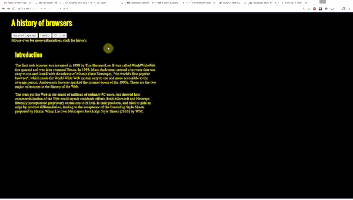

For this WOD, you will modify BrowserHistory6.
When the user clicks a button, it displays the corresponding browser in the area below the image rather than relocating to a new page. 

Here's what the page should look like and behave interacting with the user:

Here are the specifications:

- Copy BrowserHistory6 files to the new project (in VS Code you can select the files and use "copy project" then rename the copy BrowserHistory8)
- Set the id for the `
` with the Introduction text to `historyDiv`
- Copy the divs from each of the history files into index.html. Be sure you copy only the div with the history HTML and nothing else (hint: Your can collapse the entire div into a single line to copy by pressing the minus sign to the right of the line number of the open div tag).  Give them id's `ieDiv`, `firefoxDiv`, `chromeDiv` and set the style for each to `display: none` 
- Change the onclick event for each button to set the innerHTML of `historyDiv` to the innerHTML of the respective history div for that button. For example, the Internet Explorer button would have `onclick="historyDiv.innerHTML = ieDiv.innerHTML"`
- Delete the ie.html, firefox.html, and chrome.html files

HINT: This is **MUCH** easier than it sounds. *Do not over do it!* If your code is getting complex you are probably not doing the right thing!

HINT2: Take everything one step and a time and test each step. Think about what is the same and what is different. Copy things that are nearly the same when they work and change the places they are different.



If you get stuck please ask the instructor for help. You are not expected to be able to do this WOD without any help.