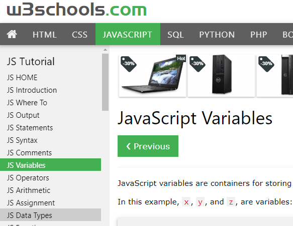

# Read the short tutorials in the following:

 <i><b><big>*Read JS Variables and JS Data Types as indicated above*</big></b></i>

### [https://www.w3schools.com/js/js_variables.asp](https://www.w3schools.com/js/js_variables.asp)

### * Note: If you skipped the previous reading of the first 7 sections you will need to do these before reading the later sections. The new sections depend greatly on knowing what in in those previous sections.*

### As an alternative to the reading, you are welcome to use any other resources such as [FreeCodeCamp Basic Javascript](https://www.freecodecamp.org/learn/javascript-algorithms-and-data-structures/basic-javascript/) and go though the same topics. FreeCodeCamp is nice in that it has interactive examples and exercises that provide feedback and help as you try them. 