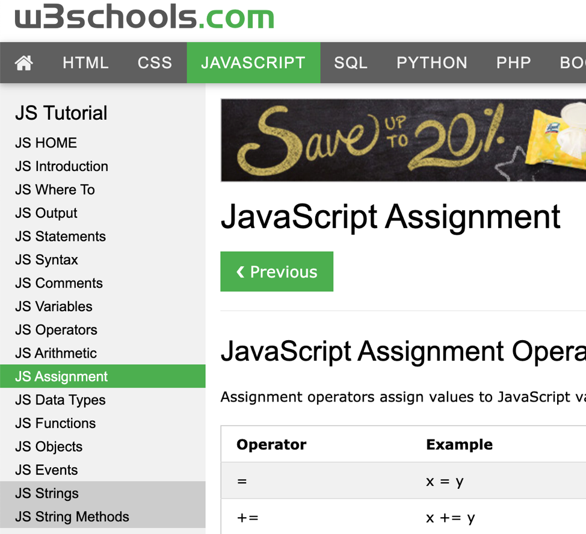

# Read the short tutorials in the following:

 <i><b><big>*Read JS Operators, Arithmetic, Assignment, Strings, String Methods, Numbers, Number Methods as indicated above. You may skip Functions, Objects, Events for now*</big></b></i>

### [https://www.w3schools.com/js/js_operators.asp](https://www.w3schools.com/js/js_operators.asp)