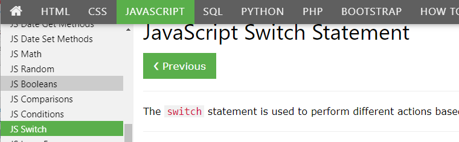

# Read the short tutorials in the following:

 <i><b><big>*Read JS Booleans, JS Comparisons, JS Conditions, JS Switch*</big></b></i>

### [https://www.w3schools.com/js/js_booleans.asp](https://www.w3schools.com/js/js_booleans.asp)