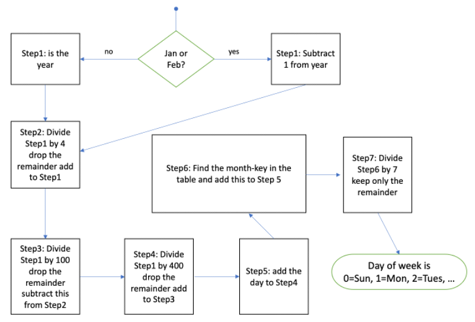

# Implementing an algorithm to determine the day of the week from a date

<p>The following is a flowchart of Tomohiho's “doomsday” algorithm to determine a day of the week:</p>

<style type="text/css">
	table.tableizer-table {
		font-size: 12px;
		border: 1px solid #CCC; 
		font-family: Arial, Helvetica, sans-serif;
	} 
	.tableizer-table td {
		padding: 4px;
		margin: 3px;
		border: 1px solid #CCC;
	}
	.tableizer-table th {
		background-color: #104E8B; 
		color: #FFF;
		font-weight: bold;
	}
    .column {
    float: left;
    width: 33.33%;
    padding: 5px;
    }
    .row::after {
    content: "";
    clear: both;
    display: table;
    }
</style>
<div class="row">
<div class="column">
<table class="tableizer-table">
<thead><tr class="tableizer-firstrow"><th>Month</th><th>month-key</th></tr></thead><tbody>
 <tr><td>January</td><td>0</td></tr>
 <tr><td>February</td><td>3</td></tr>
 <tr><td>March</td><td>2</td></tr>
 <tr><td>April</td><td>5</td></tr>
 <tr><td>May</td><td>0</td></tr>
 <tr><td>June</td><td>3</td></tr>
 <tr><td>July</td><td>5</td></tr>
 <tr><td>August</td><td>1</td></tr>
 <tr><td>September</td><td>4</td></tr>
 <tr><td>October</td><td>6</td></tr>
 <tr><td>November</td><td>2</td></tr>
 <tr><td>December</td><td>4</td></tr>
</tbody></table>
</div>
<div class="column">
<table class="tableizer-table">
<thead><tr class="tableizer-firstrow"><th>day</th><th>day number</th></tr></thead><tbody>
 <tr><td>Sunday</td><td>0</td></tr>
 <tr><td>Monday</td><td>1</td></tr>
 <tr><td>Tuesday</td><td>2</td></tr>
 <tr><td>Wednesday</td><td>3</td></tr>
 <tr><td>Thursday</td><td>4</td></tr>
 <tr><td>Friday</td><td>5</td></tr>
 <tr><td>Saturday</td><td>6</td></tr>
</tbody></table>
</div>
</div>

### Here are the specifications:

 - Implement the above algorithm in JS to determine the day of the week for ANY date. Start by defining variables `day` for the day a number from 1-31, `month` for the month (a String) "January", "February", etc., `year` a number 1900-2099 for the year
 - Use your birth date as a **test case**. 
 - Implement it in a general way that works for whatever is assigned to the variables day,month,year. No hard-coding of calculations or steps as in the lab exercise.
 - **Do not** implement it as a series of variable steps `step1 = ...` as in the Lab exercise. Each step need not be a line of code. You can combine steps to get the same result. For example, steps 2 through 5 can be done in a single line of code. Note that you do not need variables for the steps unless the result of that step is used in multiple other steps (so step1 may be useful to have as a varoable). **HINT:** This program can be written in 8 lines of code using only 2 variables for calculations!
 - Use `parseInt()` or `Math.floor()` to get the divisor and drop the remainder 
 - To handle step 1 use `if` or a *ternary operator* 
 - Make an object `monthKey` from the month-key table and use it for Step 6
 - Use the modulus operator `%` to get the remainder in Step 7
 - Make an array of days of the week strings to convert Step 7 into the day as per the day number table
 - Output the date and and the day of week to the console.



### Extra credit! Make it a web app!
 - Create a new file `dow.html` and use EMMET `!` to set up the document.
 - Put the following in the `<body>`
```HTML
    Month:<input id=month_id type="text">
    Day:<input id=day_id type="text">
    Year:<input id=year_id type="text">
    &nbsp; <span id=dow_span></span>
    <br>
    <input type="button" value="Find day of week">
```
- Add an `onclick` event attribute to the `<button>` and copy your dayoftheweek code as the value (a lot of code!). You will have to change some of the quotes inside your code to not conflict with the quotes for the `onclick` event attribute.

- Assign the `day`, `month`, `year` the `value` attribute of the respective textboxes (use `day_id`, `month_id`, `year_id`). For day and year you will need to `parseInt` to convert these strings to integers.

- Move the `monthKey` variable to the `<head>` and replace the Month textbox with
```Javascript
    Month:<select id='month_id'>
    <script>
        for(month in monthKey) {
            document.write(`<option>${month}</option>`);
        }
    </script>
    </select>
```
This last bit of code generates a select box of months using the `monthKey` object. 

- Set the innerHTML of `dow_span` to the date and and the day of the week you had output to the console.
  


If you get stuck you can ask the instructor or TA for a screencast solution.  
