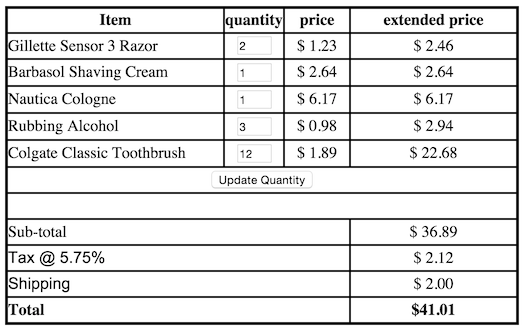

--- 
title: "Invoice6" 
published: true 
morea_id: experience-Invoice6
morea_type: experience 
morea_summary: "Update quantities in an invoice of Smartphone products"
morea_sort_order: 4
morea_labels:
 - WOD
---

# Use HTML forms to adjust quantities in an invoice of products. 

When the user changes the quantities and hits the update button the invoice re-calculates using the new quantities entered. 

*HINT: This will NOT require a lot of new code or changing a lot of the existing code*

*ANOTHER HINT: See the above hint. For real, don't make this harder that it is!*

1. Start by copying the [Invoice5](../110.HTML-forms/experience-Invoice5.html) into a new JAVASCRIPT project. Call it Invoice6 and check that the table displays properly. If you don't have a working Invoice5 you can get one [here](../110.HTML-forms/Invoice5.zip) 

2. Modify the cells in quantity column in the table to have a textboxes with whose value for product in row `$i` is  `$selected_products[$i]['quantity']` . Name the textboxes `'quantity'.$i` so they correspond to the index of the product array in `$selected_products` used for that row. Make the textboxes with `size=2`

3. In the row after all the products but before the invoice calculations, add a submit button with value "Update Quantity". Put it in the cell for the quantity column or use a single cell with `colspan=4 align=center` for this row.

4. Add form with action `<?php echo $_SERVER['JAVASCRIPT_SELF']; ?>` using the POST method. That is, this is a self-processing page. The resulting page should look like this:
 

5. In the loop that does the invoice calculations, check if there is something posted by the user and if so, use the new quantity values from the textboxes in the form. This can be done inside the calculation loop at the top. Assuming the counter `$i` for this loop, you can do something like
            
            if (isset($_POST['quantity'.$i])) {
                $selected_products[$i]['quantity'] = $_POST["quantity$i"];
            }

6. Test out your updatable invoice by putting some new values in and seeing if the invoice recalculates with the new values. Note what happens if you use bad inputs like negative numbers, floats, strings, etc. Think about how you might avoid problems with this in a future version.

