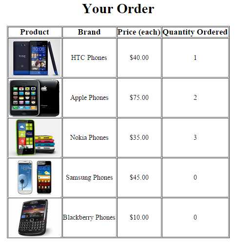

--- 
title: "SmartPhoneProducts5" 
published: true 
morea_id: experience-SmartPhoneProducts5
morea_type: experience 
morea_summary: "Select from a table of Smartphone products and display order"
morea_sort_order: 3 
morea_labels:
 - WOD
morea_start_date: "2022-10-14"
morea_end_date: "2022-10-19"
---

# Use HTML forms to select quantities from a table of Smart Phone products and display order

1. Start by reading about [SmartPhoneProducts4](../100.Arrays-I/experience-SmartPhoneProducts4.html). Then download and unzip the [SmartPhoneProducts4 project zip file](SmartPhoneProducts4.zip) into a new JAVASCRIPT project. Check that the table displays properly. Take some time to study this code and understand how it works. You will not be able to complete this WOD without understanding how the code works. It is very similar to [Invoice5](../100.Arrays-I/experience-Invoice5.html)

2. Add to the table a Quantity Desired column. In this column have textboxes with names quanity0, quantity1, quantity2, quantity3, quantity4 corresponding to the index of the product array in $products used for that row. You can do this by creating the string for the textbox name with the loop counter. e.g. `'quantity'.$i` (if you are using printf it is even easier just to add the loop counter as a string substitute `quantity%s`)

3. Add a submit button in the last row of the table in the Quantity Desired column

4. Put the table inside a form with action **process_order.php** using the POST method
The resulting page should look like this:

 

5. Create the file **process_oder.php** that will be the target of the form action and copy the data that creates the $products array and the code that generates the table.

6. Modify the Quantity Desired column to display the selected quantities from the selection page using $_POST['quantities0'], $_POST['quantities1'], etc. The resulting page should look like this:
 

 

You can view the [screencast solution here](http://youtu.be/jsjAiHIP58Y) if you get stuck.

