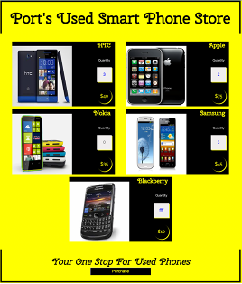
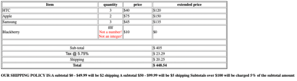

--- 
title: "Store1" 
published: true 
morea_id: experience-Store1
morea_type: experience 
morea_summary: "Select from a table of Smartphone products and display order"
morea_sort_order: 3 
morea_labels:
 - WOD
morea_start_date: "2024-03-20T00:00"
morea_end_date: "2024-03-28T23:59"
---

# Use HTML forms to select quantities from a table of Smart Phone products and display order

1. Start by creating a `Store1` project directory and copying all the files in [SmartPhoneProducts3](../100.Objects-Arrays-I/experience-SmartPhoneProducts3.html) and [Invoice3](../120.functions/experience-Invoice3.html) in this project directory. Check that `products_display.html` and `Invoice.html` display as expected. 

2. In  `products_display.html` add textboxes with names quantity0, quantity1, quantity2, quantity3, quantity4 corresponding to the index of the product array in `products`. Also add labels "Quantity Desired" for these textboxes with id's quantity0_label, quantity1_label, quantity2_label, quantity3_label, quantity4_label. You can do this by adding the HTML into the `document.write()` you have inside the loop. You may need to add some CSS to position the textbox and label properly in the `<section>`

3. Add a submit button in the `<footer>` with value "Purchase"

4. Put the `<body>` inside a form with action `./invoice.html` using the `GET` method
The resulting page should look something like this:

 

5. In `invoice.html` get the query string parameters using `params = (new URL(document.location)).searchParams`. Use a loop and `params.get()` to generate the `quantities` array.

6. Test that you can select quantities and the invoice appears with the selected quantities (and errors) when you click the Purchase button. The resulting page should look like this:
 

 

