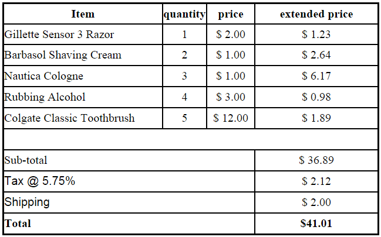

--- 
title: "Invoice7"
published: true 
morea_id: experience-Invoice7
morea_type: experience 
morea_summary: "Use a function to process an invoice of Smartphone products"
morea_sort_order: 4
morea_labels:
 - WOD
---

# This WOD will have you create a function to display an invoice of Smartphone products in two different ways - updatable, and non-updatable. 

When the user changes the quantities and hits the update button the invoice re-calculates using the new quantities entered and then displays a non-updatable invoice. This is very similar to SmartPhoneProducts6

*HINT: This will NOT require a lot of new code or changing a lot of the existing code*

1. Start by copying the [Invoice5](../110.HTML-forms/experience-Invoice5.html) into a new JAVASCRIPT project. Call it Invoice7 and check that the table displays properly. If you don't have a working Invoice5 you can get one [here](../110.HTML-forms/Invoice5.zip) 

2. Create a function with interface `void process_invoice(array $products_to_display [, bool $updatable])`. This function will take the multi-dimensional array of products $products_to_display and print the HTML table with quantity selection textboxes by default (i.e. $updatable is TRUE). If an optional $updatable is FALSE, just the quantities in the post from the textboxes will be shown in place of the selection textboxes.

3. Add logic where the invoice is printed to call `process_invoice($products, FALSE)` when the Update Quantity submit button is pressed, and calls `process_invoice($products)` when it has not been pressed.

4. Add code to only print the Update Quantity submit button when $updatable is TRUE, 

When the submit button is pressed the non-updatable invoice should look something like:

*BE CAREFUL! A common mistake is not paying attention to how % substitutions work in printf(). This will lead to the values in the table not being printed in the correct place as seen in the screenshot above*

