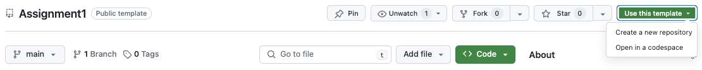

--- 
title: "Assignment 1" 
published: true 
morea_id: experience-Assignment1
morea_type: experience 
morea_summary: "Build a Simple Product Selection Application"
morea_sort_order: 3 
morea_labels:
 - Assignment
morea_start_date: "2024-03-29T00:00"
morea_end_date: "2024-04-11T23:59"
---
 

### Assignment 1: Creating an e-Commerce Web Application

#### Scenario:
The marketing director of a company selling <<_you choose the product_\>> approaches you to help her design an e-commerce website for his company. She asks you to design a website that will display _at least_ _5 different products or services_ to the user, from which they can choose _multiple quantities_ of any combination of the products or services. She asks you to perform a check to make sure that the user has entered _valid quantities_ and to then calculate the sales total, including tax and shipping/handling costs.

After completing this assignment, you should have learned the following:

*   Inventing and implementing a complete information system  
*   Building a reasonable user interface
*   Processing user input and generating responses on a server
*   Using the service as a dynamic information service
*   Interpreting and following development requirements

**Note:** You will not need to provide the actual products/services. However, you should build your application as if it will be used for this! 

_The main requirements for this assignment are the following:_

*  Use arrays (of objects) to display items and quantities available in a table.
*  Use forms to process information on a server. 
*  Allow users to select and process multiple products/services.
*  Have a server validate the data and provide feedback to the user. 

**Getting Started:** You can either choose to create a project on your own that meets the above requirements or you can follow the step-by-step guide below to help you create the project.

_**VERY IMPORTANT:**_ _You must comment all of your code!_  You may even want to create a comment on what you are trying to do before you code. The comments are for explaining what your code is used for in the program. This way when we help you, we will know what is going on. Not only because this is required, it will also help you later on when working in group projects. It may be hard for others to understand your code without clear, detailed comments. _Also remember to include your name (as author), date, and a brief description of what the code does at the top of the file._

**Part (A): Set up a project repo from the Assignment1 template**

(1) Go to [https://github.com/dport96/Assignment1](https://github.com/dport96/Assignment1) and create a new Assignment1 repo by using this repo as a template:



You *MUST* name your repo `<your lastname>_<your firstname>_Assignment1`. Make the repo private. 

(2) Clone your new repo to your local machine (in the new repo you can "open in GitHub Desktop" or whatever other method you prefer to use.


(3) Open the local repo in VSCode and open the terminal in the Repo directory. Run `npm install` then test the application by running `npm start`

(4) Study how the sample application works. You must understand how the products are displayed, how products.json is loaded and used for both displaying projects and creating an invoice, and how the form data is validated and processed on the server and if there is an error, how the user is informed of the error.

**Part (B): Design and get data for your application**

(1) Choose a product or service that you will be selling and find or make up data for this. **You MAY NOT use the same product or service as anyone in class or knowingly from an Assignment 1 in a previous class.** Modify `products.json` with this data. You will need to create a JSON object for each of your products and include the relevant details for the product such as `name, price, description`, etc. You must include a `quantity_available` attribute to each product.  

_ Example_ :

If you were selling cell phones, for each phone you would make an object containing all that particular product's information such as name/"model" number, maker (e.g. Huawei, Samsung, Apple), description, "price", "image", etc. Such as

```JSON 
{  
  "model":"Apple iPhone XS",  
  "price": 990.00,  
  "image": 'AppleXS.jpg',
  "quantity_available": 4
} 
```

(2) Modify the `store.html` and `store.js` files to display the products and information about them, including `quantity_available`. You will need to use the data from `products.json` to display the products in a table. **The form must not have any guards on the quantity input.** You must allow the user to enter any quantity they wish, even invalid quantities. You will validate the data on the server.

(3) Modify the `invoice.html` and `store.js` files to display the invoice for the products you have chosen. You will need to use the data from the form submission to display the invoice. You can use the example provided in the sample application to help you with this.

_Example_ :

For the cell phone example, we might change the display to allow for customer input as shown below:  

 <iframe src="SmartPhoneProductsA1_Example/products_display.html" style="height:375px;width:320px;" scrolling="no" frameBorder="0"></iframe> 

See [Server-side Processing Lab Ex. 4 for an example of multiple form inputs and processing](../115.Server-side-processing/experience-server-side-form-processing.html) or right-click on the above frame and view it's source for an example of getting and processing form data. 

(4) You **must use data validation** on the **server** to ensure the customer entered valid data.  Note: if valid data is not entered, display a specific error message and direct the user to enter valid data. And you must do this validation in your Javascript code **on the server**. You may not place any **guards** on the quantity inputs. For this assignment you can not, for example, use a drop-down list of quantities or use a `<input type=number>`  form element to constrain a user to enter only integer quantities. The data must be validated _before_ it is used for the invoice. You cannot just validate the data on the client unless you can guarantee your data comes from that client. **For Assignment 1, you must enable the user to enter invalid data** The grader will check for validation on the server by inputting invalid values in your quantity text boxes, so you must allow this. However, you may provide a warning notice of invalid quantities so long as it does not prevent a user from entering an invalid quantity. 

 Modify `server.js` to validate a purchase on these THREE conditions:

a. No quantities were selected (i.e. all quantities are 0)
b. A non-negative integer is input as a quantity
c. A quantity input for an item exceeds the quantity available for that item

If the purchase is invalid, you **must** provide some feedback to the user as to why and enable them to correct the problem and purchase.

_Example_ :

For the cell phone example, you should make sure that the customer entered valid quantities in the quantity boxes for each item # (1 to 5) or anything at all. If the customer entered -2.3 for item #1, you might display "Please input a non-negative integer" and enable the customer to re-enter number.

(5) Modify `server.js` so that once you have ensured the customer has entered valid data, you then update the inventory (quantity available) for the items purchased and display the purchase information in an invoice. Don't forget to include tax and shipping if necessary. But specify that the tax and/or shipping are unique to the order (don't just use a fixed shipping cost for any purchase). All output should be properly formatted (e.g. if there was a dollar amount such as $125.39 it should have two decimal points and a dollar sign).  
  

_Example_ :

<iframe src="SmartPhoneProductsA1_Example/invoice.html?quantity0=2&quantity1=&quantity2=33&quantity3=-3&quantity4=33&purchase_submit=Purchase%21" style="height:375px;width:320px;" scrolling="no" frameBorder="0"></iframe> 

See [SmartPhoneProducts3t](../100.Objects-Arrays-I/experience-SmartPhoneProducts3.html) for an example of processing an invoice from an array of products and quantities or right-click on the above frame and view it's source for an example. You do not have to generate the invoice exactly in this way. You may generate the invoice page on the server (either directly or from a template), or generate it on the client (but you still must collect and validate the form POST data on the server). 


**IMPORTANT NOTs**
- You **may** use code from the above examples and the Assignment1 template providing that you clearly specify a reference as code comments in the places where the code is used in your application. 
- You *must* not use the same design for the interface and you do not want to copy the design for processing the form as it will *not* meet the requirements for this assignment. 
- If you use code without providing a clear reference from any source, including from generative AI (ChatGPT) or code provided in class examples and labs, your assignment score will be severely penalized. Code copied needs to be fully documented (commented) and carefully adapted to the context for your application. 
- Watch out for copying code that does not do anything, repeats something already done, or is not actually used (zombie code). If you copy the Assignment1 examples and just change the data and the images you will receive 0 points for the assignment.  

**Part (C): Good UI design**

You are required to have a "good" user interface design. When you have a fully functional store (products page and invoice), choose a site template and re-design your website. It is suggested you use a [W3 Schools template](https://www.w3schools.com/w3css/w3css_templates.asp), however you may use any template you wish (such as [Bootstrap Templates](https://www.w3schools.com/bootstrap/bootstrap_templates.asp)). 

**NOTE** You *may not* just copy the design in the Assignment1 examples or WODs and substitute your products/services. These do not use templates! The user interface design is purposely awful. Be careful of copying a design from the web. There are many truly dreadful designs! For example, [http://techzonics.com/](http://techzonics.com/) is something you would **not** want to copy.

#### Individual additional requirements:
The following are additional requirements that will be assigned to you by the instructor or TA. Your assigned individual requirements are **not optional** and if not implemented, your assignment score will be severely penalized. You **may not copy** the implementation code from someone (or somewhere) else. You must design and write the code yourself. Copied code, referenced or not, will result in 0 for the entire assignment. If you are confused about the requirement or expectations, ask the instructor immediately. Once you submit your assignment, there are no excuses for not understanding the requirements and expectations. Code for your individual requirement **must** be generously commented. **Clearly** indicate in the these comments what your individual requirement is, the **scenarios** it is meant to address (why the requirement is needed), and how it is implemented. 

* **IR1** Track the total quantity of each item sold. This needs to be implemented on the server when you remove sold items from the quantity available. Display total quantity sold with the product information. Extra credit: have this dynamically update on the client when there are any purchases processed on the server (from other users).
* **IR2** Check that a quantity entered is valid (see three conditions given in the instructions above). If not, change the frame for the textbox to red and display a message with what's wrong near the input e.g. "Quantity must be a number!". If the input is valid, indicate this with a message "You want:". Do not add a guard or HTML validation that would prevent the user from entering an invalid quantity. You do not need to do this on the server. But consider the quantity available when there are multiple users purchasing.  
* **IR3** Check that the quantity entered does not exceed the quantity available as currently available on the server. If it does, change the frame for the textbox to red and display a message "We don't have xx available." and reduce the input to the quantity available (replace the input). The primary intent of this requirement is to let the user know that the amount they wanted when they try to purchase was no longer available if another user purchased before them. This means you must do this in a response from the server since it is the only place that has the current number available (consider the quantity available when there are multiple users purchasing). You do not need to do this on the server in response to a purchase, but this is probably the more straightforward way. If you only check the quantity available on the current page when the user enters it in the textbox, it will not prevent the quantity being unavailable on the server due to another users purchase. Extra credit: check if the quantity is available on the server and update the quantity available as the user enters the quantity in the textbox. That is, not in response to a purchase. 
* **IR4** If the purchase is invalid (see three conditions given in the instructions above), change the purchase button text from "Purchase" to text that indicates why the purchase is invalid e.g. "Please Select Some Items to Purchase". Do not disable the button or add a guard that prevents the user form purchasing.
* **IR5** When displaying the invoice, add a small icon image of the product to the line item. If the user hovers over the icon, have a popup window appear with a product description. 

**HINT** The IR's are not intended to be difficult or require a lot of code. They are intended to demonstrate your understanding of how your application works and has been implemented. Do think about what scenario's the requirement is intended to address (e.g. Inform the user that the quantity they want is no longer available). Do not overthink this! Keep it simple and straightforward as possible. Do not try to do the extra credit (if there is one specified) until after you implement the basic requirement. The extra credit can be **very** difficult!

** EXTRA CREDIT ** Implement any number of additional individual requirements.  

**Part (D): Testing**
(1) Create a file `Tests.txt` and write out a complete set of testing scenarios for your application. This should include testing for all the requirements listed above. You should have at least 10 test scenarios. For each scenario, you should describe the scenario, the expected result, and the actual result. You should also include a description of how you tested the scenario.

(2) Test your application with the scenarios you have written. Make sure to test all the requirements listed above. Document your test results in the `Tests.txt` file. At the end of the file, write a brief summary of your testing experience and if your application passed all the tests. Here is an example of a completed test:
```txt
Test1
Scenario: User selects 0 quantities for all items
Expected Result: User is informed that they must select at least one item to purchase  
Actual Result: User is informed that they must select at least one item to purchase
Tested by: Entering 0 in all quantity text boxes and clicking the purchase button
```

**_Checklist:_**

After completing the assignment make sure that you have addressed all of the below. Note: Having all of these does not guarantee an 'A' but you _must_ have them.

*   **Test** that your application meets all functional requirements (displays products, allows user to select product, allows user to select quantities, displays invoice with sensible tax and shipping charges along with totals, uses server to share products data and validate purchase data)
*   Commented--get in the habit now!  Put author's name and program description as comments in files. Credit given to original author when using "borrowed" code.
*   Used descriptive file names and meaningful variable names.
*   Employs good code formatting.
*   Defined and used arrays and objects for your item inventory.
*   Created tables via array data and loops.
*   Good data validation on the **server** (does not allow invalid choices, responds appropriately to invalid data). Be sure to test with invalid data.
*   Plain input text boxes are used to select quantities. **No guards** are put on to prevent the user from inputting invalid quantities (this includes the IR's).    
*   Good user interface design (easy to use and intuitive)
*   No extra files or redundant data.
*   Correct output. No parse errors or warnings.
*   Tested on the class server, using the itm352student account, saved in a folder with your name in the Assignment1 sub-folder
*   Use a website HTML template to make your site look attractive and flexible. 
*   Manages inventory. Items purchased are removed from inventory. Does not allow purchases of more than is available.  
*   You implemented your individual requirement and clearly indicated it in the code and in your submission.
    

**_ONE LAST TIME:_** You _must_ comment all of your code (you may even want to create a comment on what you are trying to do before you code). The comments are for explaining what your code is used for in the program. That way when we help you, we will know what is going on. Not only because this is required, this will also help you later on when working in group projects because it may be hard for others to understand your code. _Also remember to put your name (as the author of the code) and program description in the first part of your comments._

**Submission:**  
See the [Deploying Assignment 1 Experience](experience-Deploying-Assignment1.html). Note that you will need to make your private repo available grader and deploy your application in order to submit your assignment.