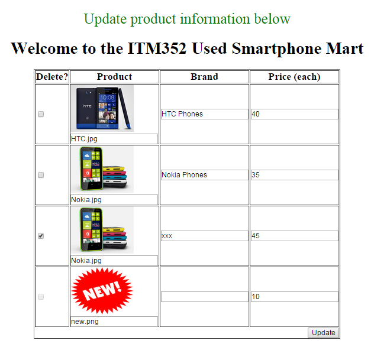
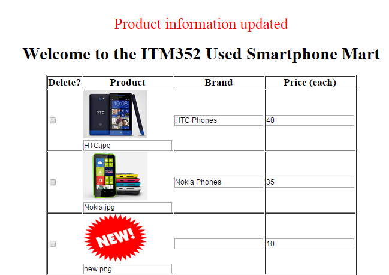

--- 
title: "ProductEditor2" 
published: true 
morea_id: experience-ProductEditor2
morea_type: experience 
morea_summary: "Build a simple delete product information editor"
morea_sort_order: 1 
morea_labels:
 - "WOD"
morea_start_date: "2017-04-06T00:00"
---

# Add delete product capability

1. Start by copying the [ProductEditor1](../140.FileIO/experience-ProductEditor1.html) into a new JAVASCRIPT project. Check that the table displays properly.

2. Now add a column to the table on the left with header "Delete" and cell entries a checkbox with name deleteproduct[$i] where $i will be the index of the product on the products array. Check that selected checkboxes appear in $_POST. It should look like this:

3. Add code to disable the checkbox for the new item. You can disable a checkbox by adding "disabled" to  the input attribute
 
`<input type=checkbox name="delete_product[$i]" disabled>`
 
Using a string to turn this on and off is suggested:
 
`$disabled_str = ($i == count($products_to_display) - 1 ) ? 'disabled' : '';`
 

4. Add code where you are writing the updated product info to the file to skip the deleted items and remove them from the products array:
 

if(@$_POST['delete_product'][$i]=='on') {
            print "Deleted product $i ";
            array_splice($selected_products, $i, 1);
            continue;
}

   
When the products are deleted it should look something like this:
 

