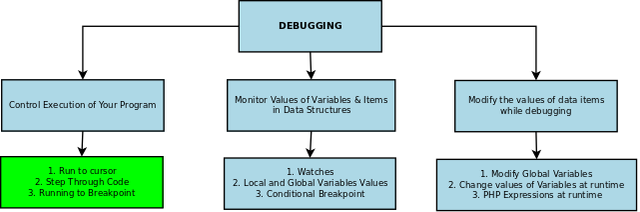

--- 
title: "Debugging" 
published: true 
morea_id: experience-Debugging
morea_type: experience 
morea_summary: "Debugging Methodology and Methods"
morea_sort_order: 1 
morea_labels:
 - Lab Lecture
morea_start_date: "2023-11-14T00:00"
---

### Instructions: 
Open the [presentation slides](ITM352_Debugging.ppt). When asked by the instructor do the lab exercises listed. Use JAVASCRIPT unless asked to do otherwise.

Do all your code work in VS Code. Please ask the instructor for help if you get stuck this is **NOT** a test.

The exercises can be found in the presentation slides



### Exercise 1
Debug the following 
```Javascript
product = {name:'small gumball', price:'$0.34’};

tax_rate = 0.045;

total = product.price + product.price * tax_rate;

console.log(`A ${product.name} costs ${total}`); 
```

### Exercise 2
Debug the following 
```Javascript
prices = [5.95, 3.00, 12.50];
total_price = 0;
tax_rate = 1.08;    // 8% tax 
for (price of prices) {
    total_price = price * tax_rate;
}
console.log(`Total price (with tax): ${total_price.toFixed(2)}`); 
```

### Exercise 3
Debug the following
```Javascript
<script>
    const urlParams = new URLSearchParams(window.location.search);
    if (urlParams.has('Submit')) {
        for (value of urlParams.values()) {
            if (value = "Tyler") {
                document.write("Found him!");
            else document.write("I couldn't find Tyler :("); 
            }
        }
        }
        window.stop();
    }
</script>
<form action="" method="GET">
        Name: <input  name="name"><br>
        <input type="submit" name="Submit" value="Send GET Request">
</form>
```

### Exercise 4
Debug the following in node

```Javascript
const express = require('express');
const app = express();


app.get('/', function(req,res) {
    res.send(
        '<form action="/process_form" method="POST">
            Name1: <input  name="name1"><br>
            Name2: <input  name="name1"><br>
            <input type="submit" name="Submit" value="Send POST Request">
        </form>'
        );
});

app.post('/processform', function(req, res) {
    if (typeof req.body['Submit'] != 'undefined') {
        for (value in req.body) {
            if (value == "Tyler") {
                res.send("Found him!");
            } else {
                res.send("I couldn't find Tyler :(");
            }
        }
        
    }
});

app.listen(8080, () => console.log(`listening on port 8080`));
```