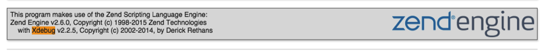
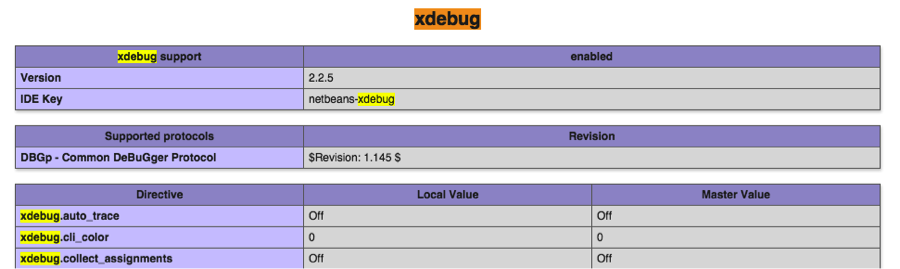

--- 
title: "XDebug and VS Code" 
published: true 
morea_id: reading-Xdebug
morea_type: reading 
morea_summary: "Using XDebug and VS Code"
morea_sort_order: 1 
morea_labels:
 - Tool Check
morea_start_date: "2018-10-09T12:00"
---

### Check that XDebug works in NetBeans
Open any project. Click on the menu item Debug -> Debug Project (or use ctrl-F5 on Windows or CMD-5 on a Mac).

Look at the bottom of the NetBeans window. If you see "netbeans-xdebug     running" then you're ready to go. You should see a "NetBeans Connector" is debugging this tab in your browser and then in the code editor within Netbeanns the first line of code should be highlighted.

If you do not get the above you may have to configure NetBeans or replace XAMPP with MAMP or vice versa. 

1. Start by going to [https://xdebug.org/wizard.php](https://xdebug.org/wizard.php) and copy and paste the output of phpinfo() into the textbox. Follow the instructions as to what xdebug file to download and where to put it. Make sure you download the xdebug dll and save it to the correct location and add the zend_extension line to the php.ini file. NOTE for Mac users! If it instructions indicate you need to build XDebug (look for a lot of instructions and not a simple download this dll file) you can try the pre-build version I've placed in Laulima -> Resources -> XDebug_for_Mac

#### instructions for XDebug NetBeans for Mac
0. Locate your XAMPP php.ini file and open it in a text editor such as TextEdit. You may need to run this as administrator or change its file permissions. 
It's probably in /Applications/XAMPP/etc but you can check the output of phpinfo() to be sure

2. Find the line `output_buffering=4096` and change it to `output_buffering=Off`. 

3. Put the following after the line you added to load the zend_extension dll (from above)

[xdebug]
xdebug.default_enable=1
xdebug.remote_enable=on
xdebug.remote_handler=dbgp
xdebug.remote_host=localhost
xdebug.remote_port=9000
xdebug.remote_autostart=1
xdebug.idekey="netbeans-xdebug"
xdebug.remote_mode=req


4. Restart Apache and look at the output of phpinfo(). Search for xdebug in the webpage and you should find the following:
 and 

5. Try the debugger in NetBeans

#### instructions for XDebug NetBeans for Windows 

1. Locate your XAMPP php.ini file and open it in a text editor such as Notepad. 
It's probably in C:\XAMPP\php but you can check the output of phpinfo() to be sure. You can also use the 
XAMPP control panel and click on the Config button then select php.ini

2. Add the following after the zend_extension line you added (e.g. zend_extension = C:\xampp\php\ext\php_xdebug-2.5.4-7.1-vc14.dll) 

[XDebug]
zend_extension = "C:\xampp\php\ext\php_xdebug.dll"
xdebug.profiler_append = 0
xdebug.profiler_enable = 1
xdebug.profiler_enable_trigger = 0
xdebug.profiler_output_dir = "C:\xampp\tmp"
xdebug.profiler_output_name = "cachegrind.out.%t-%s"
xdebug.remote_enable = 1
xdebug.remote_handler = "dbgp"
xdebug.remote_host = "127.0.0.1"
xdebug.trace_output_dir = "C:\xampp\tmp"
xdebug.remote_port=9000
xdebug.idekey="netbeans-xdebug"


3. Restart Apache and look at the output of phpinfo(). Search for xdebug in the webpage and you should find the following:
 and 

4. Try the debugger in NetBeans

If you do not get the above to work you may have to configure NetBeans or replace XAMPP with MAMP or vice versa. 

